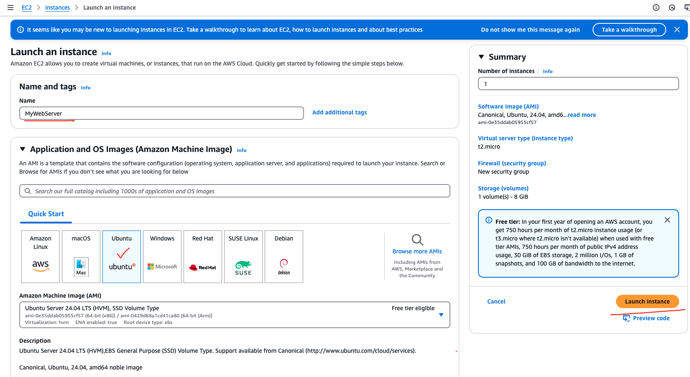

## Sample HTTPD Project: Hosting a Website on EC2

### Steps to Create an EC2 Instance

1. **Log in to the AWS Management Console**  
    Navigate to the [AWS Management Console](https://aws.amazon.com/console/) and sign in with your credentials.

2. **Launch an EC2 Instance**  
    - Go to the EC2 Dashboard and click on "Launch Instance."
    - Choose an Amazon Machine Image (AMI), lets take ubuntu

3. **Select an Instance Type**  
    Choose an instance type, such as `t2.micro` (eligible for the free tier).

4. **Configure Instance Details**  
    - Set the number of instances to 1.
    - Configure other settings as needed, or leave them as default.

5. **Add Storage**  
    Specify the storage size and type. The default settings are usually sufficient for this project

6. **Add Tags**  
    Add tags to help identify your instance (e.g., `Name: MyWebServer`).

7. **Configure Security Group**  
    - Create a new security group or select an existing one.
    - Allow inbound traffic on port 22 (SSH) and port 80 (HTTP).

8. **Review and Launch**  
    Review your settings and click "Launch." Select or create a key pair to connect to the instance.




9. **Access Your Instance**  
    Once the instance is running, use the public IP address and your key pair to connect via SSH:
    ```bash
    ssh -i your-key.pem ubunut@your-ec2-public-ip
    ```

    


### Steps to Host a Website
1. **Connect to Your EC2 Instance**  
    Use SSH to connect to your EC2 instance:
    ```bash
    ssh -i your-key.pem ec2-user@your-ec2-public-ip
    ```

2. **Install Apache HTTPD**  
    Update the package manager and install the Apache HTTPD server:
    ```bash
    sudo apt update -y
    sudo apt install apache2 -y
    ```

3. **Start and Enable HTTPD Service**  
    Start the HTTPD service and enable it to run on boot:
    ```bash
    sudo systemctl start apache2
    sudo systemctl enable apache2
    ```
    Ensure apache is properly started by checking `sudo systemctl status apache2`

    

4. **Create a Sample Website**  
    Create an `index.html` file in the default web directory:
    ```bash
    echo "<h1>Welcome to My Sample HTTPD Project!</h1>" | sudo tee /var/www/html/index.html
    ```

5. **Access the Website**  
    Open a browser and navigate to `http://your-ec2-public-ip`. You should see your sample website.
