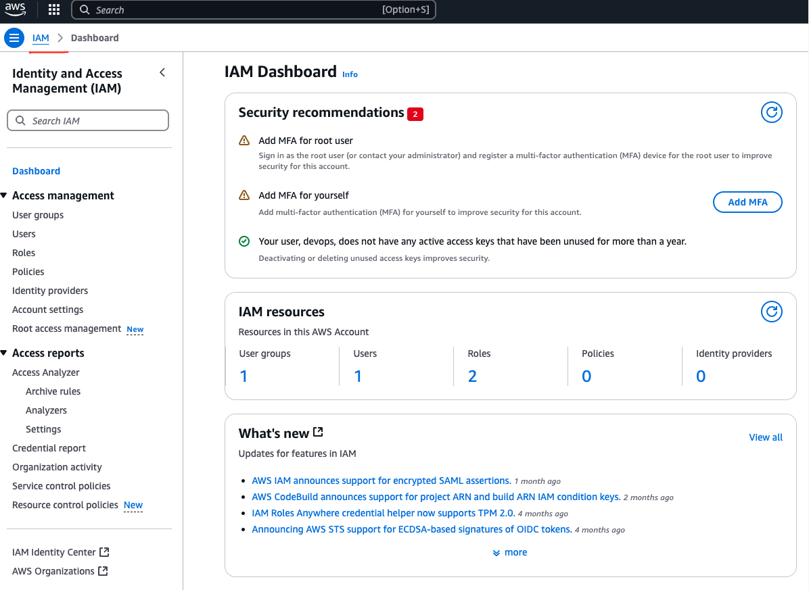

# AWS IAM Project: Managing Access for Multiple Teams

## Scenario
A company has developers, testers, and admins who need access to different AWS services.

## Solution
1. **Create IAM Groups**: 
   - Developers
   - Testers
   - Admins

2. **Assign Appropriate Permissions**: 
   - Developers: Access to EC2, Lambda, S3 (read/write).
   - Testers: Access to S3 (read-only), CloudWatch.
   - Admins: Full access to all AWS resources.

3. **Add Users to Groups**: 
   - Create individual IAM users for each team member.
   - Add them to their respective groups.

## Benefit
Easier to manage access when team members join or leave. Simply add or remove users from the groups.

## Implementation Steps

1. Open the **IAM Console**



2. Go to **Groups** and click **Create New Group**.
3. Name the group (e.g., `Developers`, `Testers`, `Admins`).


4. Attach policies based on the roles described.
5. Go to **Users** and click **Add User**.
6. Add users and assign them to the respective groups.

## Example AWS CLI Commands

### Creating Groups
```
aws iam create-group --group-name Developers
aws iam create-group --group-name Testers
aws iam create-group --group-name Admins
```

### Attaching Policies
```
aws iam attach-group-policy --group-name Developers --policy-arn arn:aws:iam::aws:policy/AmazonS3FullAccess
aws iam attach-group-policy --group-name Testers --policy-arn arn:aws:iam::aws:policy/AmazonS3ReadOnlyAccess
aws iam attach-group-policy --group-name Admins --policy-arn arn:aws:iam::aws:policy/AdministratorAccess
```

### Creating Users and Adding to Groups
```
aws iam create-user --user-name Alice
aws iam add-user-to-group --user-name Alice --group-name Developers
```

## Conclusion
Using IAM groups simplifies access management and improves security by grouping users based on their roles.
