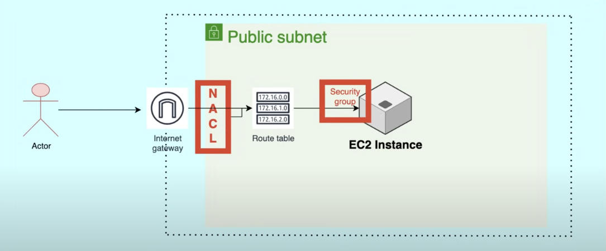

## What is AWS VPC?

Amazon Virtual Private Cloud (VPC) is a service that lets you launch AWS resources in a logically isolated virtual network that you define. It provides complete control over your virtual networking environment, including resource placement, connectivity, and security.

### VPC Size and IP Range

The size of a VPC is determined by the IP address range you specify when creating it. This range is defined using CIDR (Classless Inter-Domain Routing) notation. For example, a VPC with a CIDR block of `10.0.0.0/16` can accommodate up to 65,536 IP addresses.

### Private and Public Subnets

In a VPC, you can create both private and public subnets:

- **Public Subnet**: A subnet that is associated with a route table containing a route to an internet gateway. Resources in a public subnet can communicate directly with the internet.
- **Private Subnet**: A subnet that does not have a route to an internet gateway. Resources in a private subnet cannot directly access the internet but can communicate with other resources in the VPC.

This separation allows you to design secure and scalable architectures by isolating sensitive resources in private subnets while exposing only necessary resources in public subnets.

### NAT Gateway and Private Subnets

A NAT Gateway allows resources in private subnets to access the internet securely by enabling outbound connections while blocking unsolicited inbound traffic.

### Security at the Subnet Level -

To enhance security at the subnet level in a VPC, you can use the following mechanisms:

1. **Network Access Control Lists (NACLs)**:
    - NACLs act as a stateless firewall for controlling inbound and outbound traffic at the subnet level.
    - You can define rules to allow or deny specific IP addresses, protocols, or port ranges.
    - NACLs are evaluated in order, starting from the lowest numbered rule.

2. **Subnet Isolation**:
    - Use private subnets for sensitive resources that do not require direct internet access.
    - Ensure that public subnets are only used for resources that need to communicate with the internet.

3. **Route Tables**:
    - Configure route tables to control the flow of traffic between subnets and external networks.
    - Avoid adding routes to the internet gateway for private subnets.

4. **Security Groups**:
    - Although security groups are applied at the instance level (ec2), they complement subnet-level security by restricting traffic to and from specific instances within the subnet.

By combining these mechanisms, you can create a secure and well-isolated network architecture within your VPC.

### Default Security Group Behavior

By default, AWS security groups allow all outbound traffic except for port 25, which is used for email services. This restriction is in place to prevent spam and abuse.
- **Default Rules**:
    - Inbound: No inbound traffic is allowed by default.
    - Outbound: All outbound traffic is allowed except for port 25.

