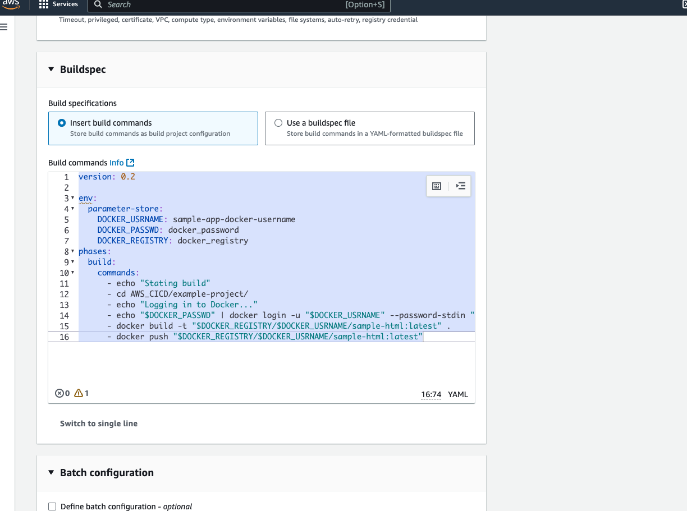
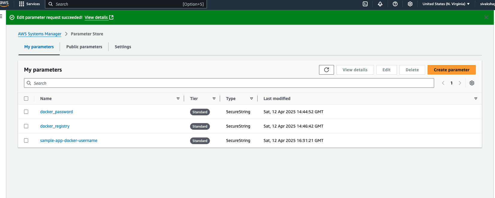
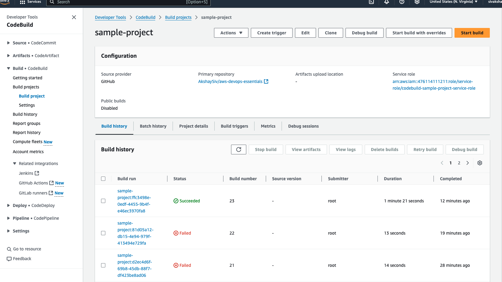
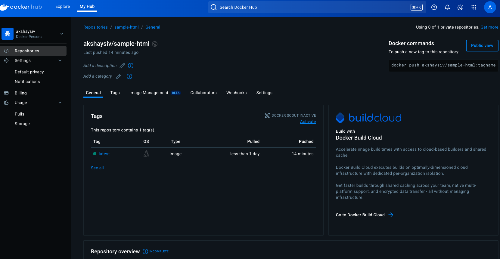
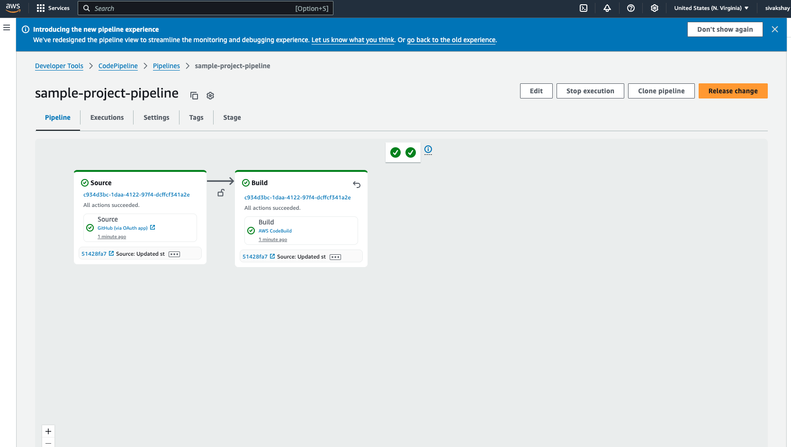
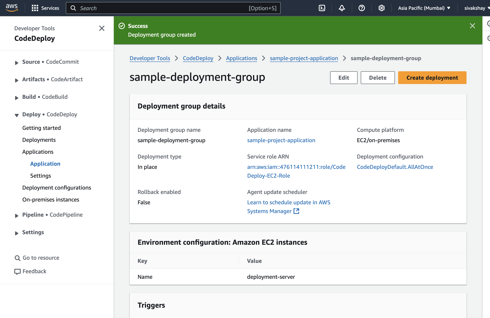
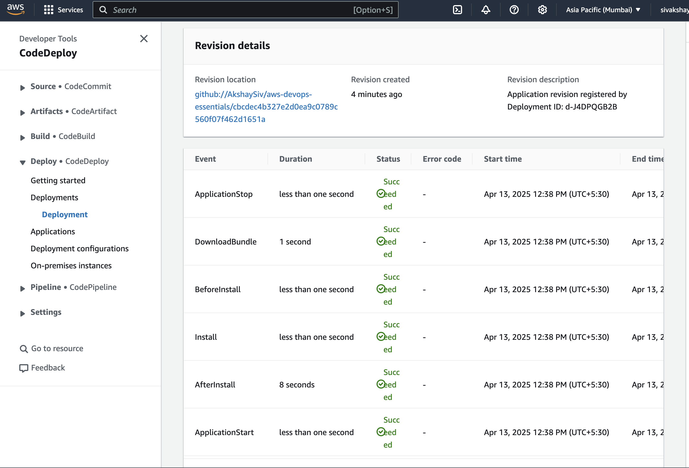

# 📦 Simple Static HTML Site with Docker and Nginx

This project demonstrates how to serve a static `index.html` page using Docker and Nginx. Useful for AWS CodeBuild/CodePipeline demos.

---


## 🚀 Steps to Create a Project in AWS CodeBuild

1. **Navigate to CodeBuild**  
    Go to the [AWS Management Console](https://aws.amazon.com/console/) and open the CodeBuild service.

2. **Create a New Project**  
    - Click on **Create build project**.
    - Provide a **Project name** (`sample-project`).

3. **Source Configuration**  
    - Choose the **Source provider** select GitHub
    - Connect your repository

4. **Environment Settings**  
    - Select the **Environment image** (e.g., AWS-managed image).
    - Choose the **Operating system** and **Runtime** Ubuntu
    - Specify the **Buildspec file** (use `buildspec.yml` from github) or define inline commands
    - Create a service role `codebuild-sample-project-service-role`

5. **Start the Build**  
    - Save the project and click **Start build** to test the configuration.

    

---  

## 🔑 Using AWS Systems Manager Parameter Store for Docker Credentials

To securely manage Docker credentials, you can use AWS Systems Manager Parameter Store. Follow these steps:

1. **Store Docker Credentials in Parameter Store**  
    - Navigate to the [AWS Systems Manager Console](https://console.aws.amazon.com/systems-manager/).
    - Go to **Parameter Store** and click **Create parameter**.
    - Set the **Type** to `SecureString`.
    

2. **Update IAM Role with Access to Parameter Store**  
    - Navigate to the [IAM Console](https://console.aws.amazon.com/iam/).
    - Select the IAM role  `codebuild-sample-project-service-role `
    - Attach a policy that grants access to the Parameter Store `AmazonSSMFullAccess`    

By granting this access, your CodeBuild project can securely retrieve Docker credentials from the Parameter Store.


## Start Build



Once build is completed the image should be available in dockerhub




Now Lets intergate codebuild with AWS codepipeline

## 🔄 Steps to Create a CodePipeline and Integrate with CodeDeploy

1. **Navigate to CodePipeline**  
    Go to the [AWS Management Console](https://aws.amazon.com/console/) and open the CodePipeline service.

2. **Create a New Pipeline**  
    - Click on **Create pipeline**.
    - Provide a **Pipeline name** (`sample-project-pipeline`).
    - Select a new role for the pipeline.

3. **Add Source Stage**  
    - Choose the **Source provider** GitHub
    - Connect your repository

4. **Add Build Stage**  
    - Choose **AWS CodeBuild** as the build provider.
    - Select the previously created CodeBuild project (`sample-project`).

<!-- 5. **Add Deploy Stage**  
    - Choose **AWS CodeDeploy** as the deploy provider.
    - Select the application and deployment group configured in CodeDeploy. -->

6. **Review and Create Pipeline**  
    - Review the pipeline configuration.
    - Click **Create pipeline** to save and start the pipeline.

7. **Trigger the Pipeline**  
    - Push changes to the configured branch in your repository.
    - The pipeline will automatically trigger, build, and deploy the application.

By following these steps, you can integrate CodeBuild with CodePipeline and deploy your application using CodeDeploy.



## 🛠️ Steps to Create a CodeDeploy Application and Deployment Group

1. **Navigate to CodeDeploy**  
    Go to the [AWS Management Console](https://aws.amazon.com/console/) and open the CodeDeploy service.

2. **Create a New Application**  
    - Click on **Create application**.
    - Provide an **Application name** `sample-application`.
    - Select the **Compute platform**`EC2/On-premises`
    ### Install the CodeDeploy Agent on EC2 Instance

    To use CodeDeploy with an EC2 instance, you need to install the CodeDeploy agent. Follow these steps:

    1. **Connect to the EC2 Instance**  
        - Use SSH to connect to your EC2 instance.

    2. **Update the Package Manager**  
        ```bash
        sudo yum update -y
        ```

    3. **Install the CodeDeploy Agent**  
        
        https://docs.aws.amazon.com/codedeploy/latest/userguide/codedeploy-agent-operations-install-ubuntu.html

    4. **Verify the Installation**  
        ```bash
        sudo service codedeploy-agent status
        ```
        Ensure the agent is running. If not, start it:
        ```bash
        sudo service codedeploy-agent start
        ```

    5. **Tag the Instance**  
        - Navigate to the [AWS EC2 Console](https://console.aws.amazon.com/ec2/).
        - Select the instance and add a tag with the key `env` and value `prod`.

    ### Create an IAM Role for EC2 to Communicate with CodeDeploy

    1. **Navigate to the IAM Console**  
        Go to the [AWS IAM Console](https://console.aws.amazon.com/iam/).

    2. **Create a New Role**  
        - Click on **Roles** in the left navigation pane.
        - Click **Create role**.

    3. **Select Trusted Entity**  
        - Choose **AWS service**.
        - Select **EC2** as the use case and click **Next**.

    4. **Attach Policies**  
        - Search for and select the **AWSCodeDeployRole** policy.

    5. **Name the Role**  
        - Provide a **Role name** (`CodeDeploy-EC2-Role`).
        - Click **Create role**.

    6. **Attach the Role to the EC2 Instance**  
        - Navigate to the [AWS EC2 Console](https://console.aws.amazon.com/ec2/).
        - Select the instance you want to use with CodeDeploy.
        - Click **Actions** > **Security** > **Modify IAM Role**.
        - Select the newly created role (`CodeDeploy-EC2-Role`) and save.

    7. **Restart the CodeDeploy Agent again**  
        Alternatively, you can restart it directly:
        ```bash
        sudo service codedeploy-agent restart
        ```

    By completing these steps, your EC2 instance will have the necessary permissions to communicate with CodeDeploy.

    By completing these steps, your EC2 instance will be ready for CodeDeploy.

3. **Create a Deployment Group**  
    - Click on **Create deployment group**.
    - Provide a **Deployment group name** (`sample-deployment-group`).
    - Select the **Service role** that CodeDeploy will use to access resources.
    - Configure the **Deployment type** `In-place`

4. **Save the Deployment Group**  
    - Review the settings and click **Create deployment group**

    

6. **Deploy the Application**  
    - Navigate to the application and click **Create deployment**.
    - Specify the **Revision location** GitHub repository.
    - Select the **Deployment group** created earlier.
    - Click **Create deployment** to start the deployment process

    ## 📄 Creating the `appspec.yml` File

    To enable CodeDeploy to manage the deployment process, you need to create an `appspec.yml` file in the root of your GitHub repository. This file defines the deployment lifecycle hooks and specifies the actions to take during each phase.

    ### Example `appspec.yml` File

    ```yaml
    version: 0.0
    os: linux
    files:
        - source: /
            destination: /home/ec2-user/app

    hooks:
        BeforeInstall:
            - location: scripts/stop_container.sh
                timeout: 300
                runas: root
        AfterInstall:
            - location: scripts/start_container.sh
                timeout: 300
                runas: root
    ```

    ### Explanation of the `appspec.yml` File

    1. **`files` Section**  
         - Specifies the source and destination for the application files.
         - In this example, all files from the repository root are copied to `/home/ec2-user/app`.

    2. **`hooks` Section**  
         - Defines lifecycle event hooks to execute custom scripts during deployment.
         - **`BeforeInstall`**: Stops any running container using the `stop_container.sh` script.
         - **`AfterInstall`**: Starts the container using the `start_container.sh` script.

    ### Creating the Hook Scripts

    1. **`stop_container.sh`**  
         This script stops any running Docker container.

         ```bash
         #!/bin/bash
         echo "Stopping running containers..."
         docker stop $(docker ps -q) || true
         docker rm $(docker ps -a -q) || true
         ```

    2. **`start_container.sh`**  
         This script starts the Docker container with the updated application.

         ```bash
         #!/bin/bash
         echo "Starting container..."
         docker run -d -p 80:80 --name my-app my-docker-image:latest
         ```

    3. **Make the Scripts Executable**  
         Ensure the scripts are executable by running the following command:

         ```bash
         chmod +x scripts/stop_container.sh scripts/start_container.sh
         ```

    By adding the `appspec.yml` file and the relevant hook scripts, you can automate the deployment process and manage the lifecycle of your application containers effectively.

    Now the deployment stage should be success

    

## 🔗 Integrating CodeDeploy with CodePipeline

To complete the integration of CodeDeploy with CodePipeline, follow these steps:

1. **Add Deploy Stage in CodePipeline**  
    - Navigate to the [AWS CodePipeline Console](https://console.aws.amazon.com/codepipeline/).
    - Select the pipeline you created earlier (`sample-project-pipeline`).
    - Click **Edit** and add a new stage.

2. **Configure Deploy Stage**  
    - Provide a **Stage name** (`Deploy`).
    - Add an **Action group** and choose **AWS CodeDeploy** as the action provider.
    - Select the **Application name** (`sample-application`) and **Deployment group** (`sample-deployment-group`) created earlier.

3. **Save and Update the Pipeline**  
    - Click **Done** to save the deploy stage.
    - Click **Save pipeline changes** to update the pipeline.

4. **Trigger the Pipeline**  
    - Push changes to the configured branch in your repository.
    - The pipeline will automatically trigger, build, and deploy the application using CodeDeploy.

By completing these steps, your CodePipeline will now include a deploy stage that integrates with CodeDeploy, enabling a fully automated CI/CD workflow.

