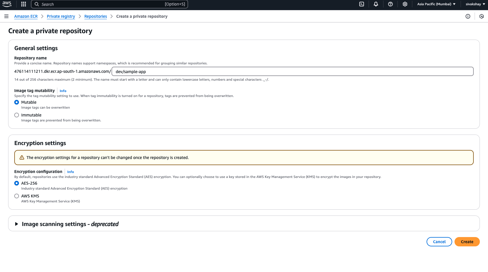
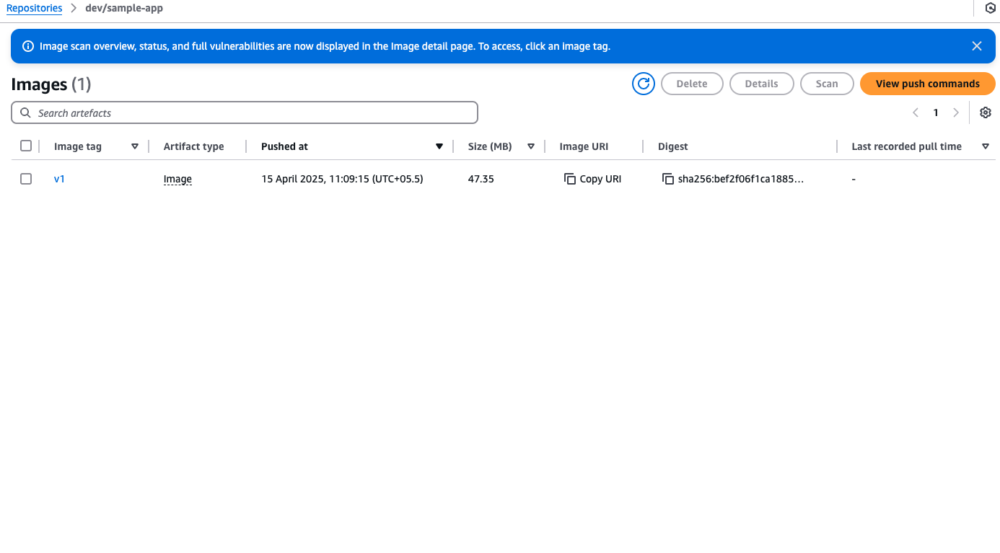

# Pushing a Sample Image to AWS ECR

Follow these steps to create a sample Docker image and push it to AWS Elastic Container Registry (ECR).

## Prerequisites
1. Install the AWS CLI and Docker.
2. Configure AWS CLI with `aws configure`.
3. Ensure you have permissions to push to ECR.

## Steps

### 1. Create an ECR Repository




### 2. Create a Sample Dockerfile
```dockerfile
# Dockerfile
FROM python:3.9-slim
COPY app.py /app.py
CMD ["python", "app.py"]
```

### 3. Create a Sample Application
```python
# app.py
print("Hello, AWS ECR!")
```

### 4. Build the Docker Image
```bash
docker build -t sample-app .
```

### 5. Authenticate Docker to AWS ECR
To view the push commands for your repository, navigate to the AWS Management Console, go to the ECR service, select your repository, and click on the "View push commands" button. This will display the necessary commands to authenticate, tag, and push your image.

```bash
aws ecr get-login-password --region <region> | docker login --username AWS --password-stdin <account_id>.dkr.ecr.<region>.amazonaws.com
```

### 6. Tag the Docker Image
```bash
docker tag sample-app:latest <account_id>.dkr.ecr.<region>.amazonaws.com/sample-app:latest
```

### 7. Push the Image to ECR
```bash
docker push <account_id>.dkr.ecr.<region>.amazonaws.com/sample-app:latest
```

### 8. Verify the Image in ECR
Go to the AWS Management Console, navigate to ECR, and confirm the image is uploaded.

